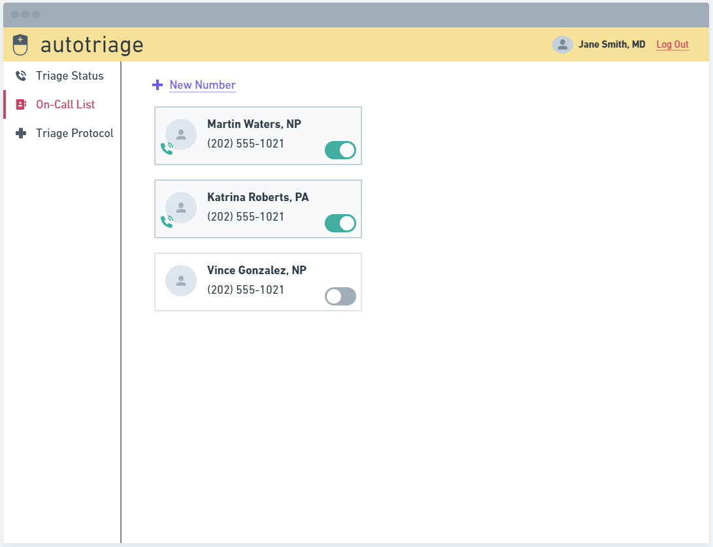

# AutoTriage - connect to critical patients faster
## About
This is my submissions for the [Twilio](https://www.twilio.com) + [DEV.to](https://dev.to/devteam/announcing-the-twilio-hackathon-on-dev-2lh8) hackathon during the month of April, 2020.

During the initial spread of COVID-19 there was a substantial demand for testing. However, due to limited testing capacity the CDC advised only patients that had travel history involving specific countries, or presented a particular combination of symptoms, could receive a 'referral' to be tested. Patients who did not meet those parameters were considered 'stable' and told to self-isolate, get rest, and contact the doctor if symptoms progress or worsen. 

'AutoTriage' is web application that leverages the [Twilio Autopilot](https://www.twilio.com/docs/autopilot) API to screen human callers, using a list of doctor-configurable rules to determine which patients need to be connected to a medical professional and which patients are stable enough to exercise self-care.

This type of system is perfect for small medical practices who may not have the resources to field multiple calls from patients, or whose staff is required to work from home. During the current pandemic, many local governments set up telephone helplines where citizens could call and be connected to a qualified nurse to have their COVID-related questions answered. There were still large hold times on some of these lines, something that would be less likely to occur with an app like AutoTriage.

## How it works
Here's an example to demonstrate the app workflow.


## Features

- Node.js web server using [Express.js](https://npm.im/express)
- User interface to setup IVR responses using [Twilio Helper Library](https://www.twilio.com/docs/libraries/node).
- TBD

## Wireframe
In an attempt to better convey the intent of this application, the following wireframes were created. These are simplified versions of basic requirements to get the app to MVP. The final product may look entirely different.

1. The sign-in screen. 

    

1. The main page, showing the app is disabled. 

    

1. The main page, showing the app is enabled.

    

1. Managing the contacts for on-call personnel. 

    

1. The protocol page, showing the doctor-configured rules. 

    


## Set up

### Requirements

- [Node.js](https://nodejs.org/)
- A Twilio account - [sign up](https://www.twilio.com/try-twilio)

### Twilio Account Settings

This application should give you a ready-made starting point for writing your
own IVR application using Autopilot. Before we begin, we need to collect
all the config values we need to run the application:

| Config&nbsp;Value | Description                                                                                                                                                  |
| :---------------- | :----------------------------------------------------------------------------------------------------------------------------------------------------------- |
| Account&nbsp;Sid  | Your primary Twilio account identifier - find this [in the Console](https://www.twilio.com/console).                                                         |
| Auth&nbsp;Token   | Used to authenticate - [just like the above, you'll find this here](https://www.twilio.com/console).                                                         |
| Phone&nbsp;number | A Twilio phone number in [E.164 format](https://en.wikipedia.org/wiki/E.164) - you can [get one here](https://www.twilio.com/console/phone-numbers/incoming) |

### Local development
⚠ **NOTE: This section is currently a WIP**

After the above requirements have been met:

1. Clone this repository and `cd` into it
    
    ```bash
    git clone git@github.com:jep/autotriage.git
    cd autotriage
    ```

1. Install dependencies
    
    ```bash
    npm install
    ```

1. Set your environment variables
    
    ```bash
    npm run setup
    ```
    
    See [Twilio Account Settings](#twilio-account-settings) to locate the necessary environment variables.

1. Run the application

    ```bash
    npm start
    ```
    
    Alternatively, you can use this command to start the server in development mode. It will reload whenever you change any files.
    
    ```bash
    npm run dev
    ```
    
    Your application is now accessible at [http://localhost:3000](http://localhost:3000/)


## License

[MIT](http://www.opensource.org/licenses/mit-license.html)

## Disclaimer

No warranty expressed or implied. Software is as is.

[twilio]: https://www.twilio.com
